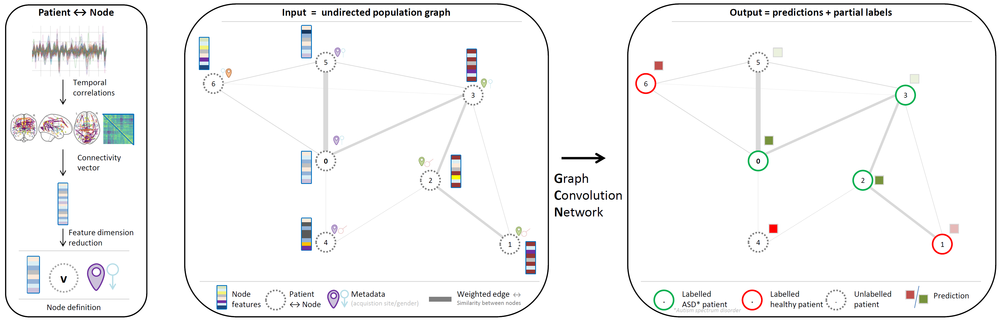
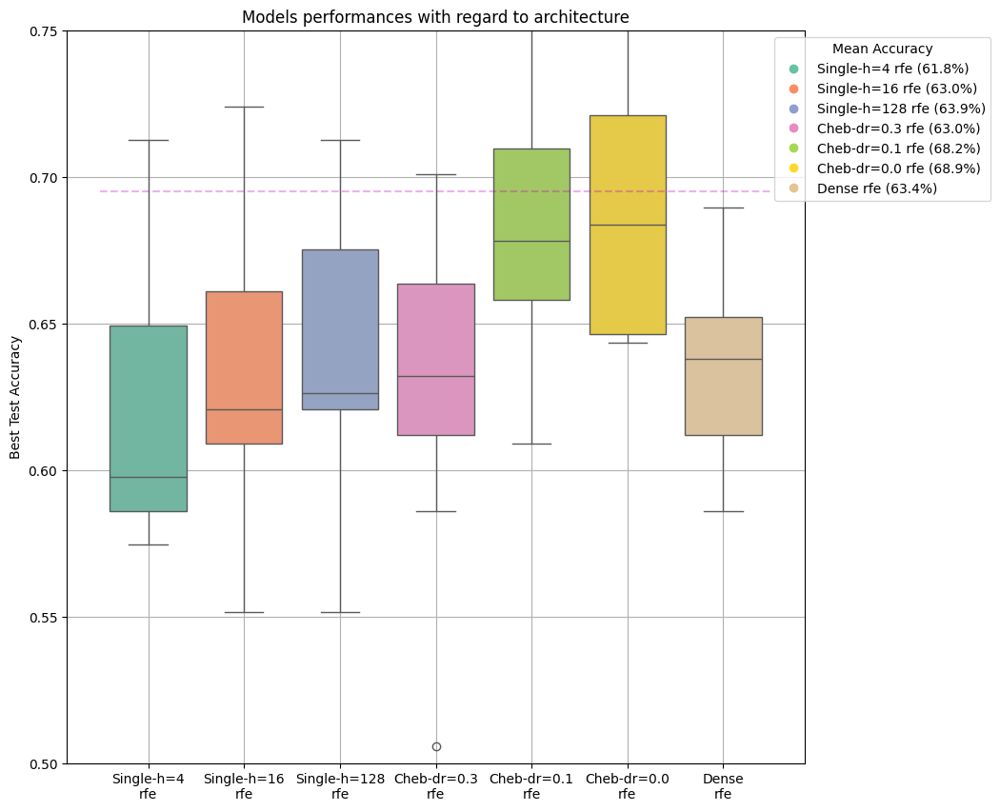
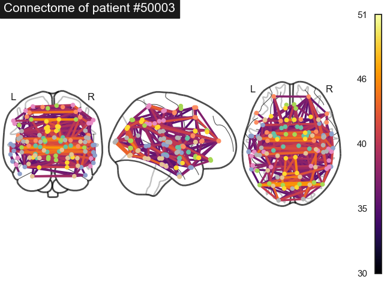
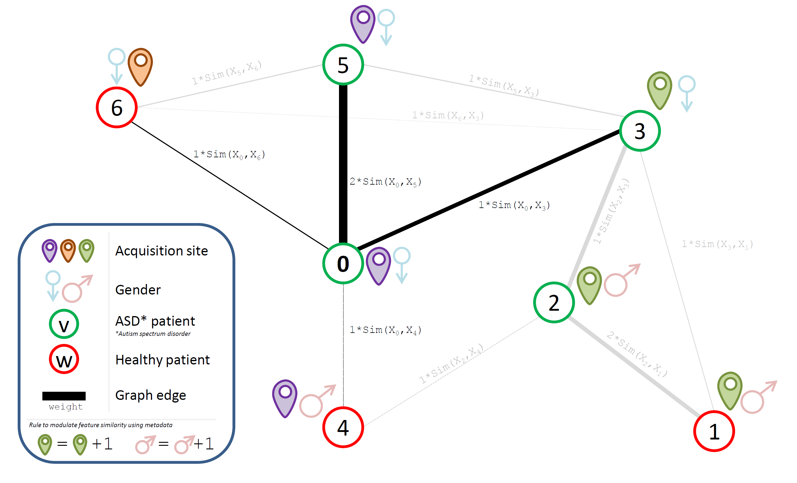

# Spectral graph convolutions
Student review on [Spectral Graph Convolutions for Population-based Disease Prediction](https://arxiv.org/abs/1703.03020)

We only deal with the ABIDE dataset dedicated to the study of ASD (*autism spectrum disorder*).


# :scroll: [Report](/report/87_Ines_VATI_Manal_AKHANNOUSS_Balthazar_NEVEU.pdf)

# :memo: [Slides](/report/slides.pdf)

## Authors
- Program: [MVA Master's degree](https://www.master-mva.com/) class on [Geometric Data Analysis](https://www.jeanfeydy.com/Teaching/index.html). ENS Paris-Saclay.
- Authors
    - [Manal Akhannous](https://github.com/ManalAkh)
    - [Ines Vati](https://github.com/InesVATI)
    - [Balthazar Neveu](https://github.com/balthazarneveu)




> Overview of the use of **graph convolutional networks** to predict ASD (autism spectrum disorder).
The ABIDE dataset was created to study autism and contains a set of functional MRI from 871 patients 
of different genders and captured over 17 different sites with different f-MRI devices. Input data is scarce and not totally homogeneous.
On the left, the creation of the content of a single node is shown. 111 temporal series are extracted from the f-MRI and correlation allows creating a connectivity 111×111 symmetric matrix of the brain of each patient.
A population graph is created by connecting each patient (node) to the other patients, with an edge weighted by the similarity between the patients.
It is processed by a graph convolutional network to predict the ASD status of each patient (a probability of being healthy or affected by ASD).
Nodes are partially labelled to split the dataset between training (80%), validation (10%) and test set (10%).

-----------

### Content


-----------


### Getting started
Create a dedicated environment, use [`requirements.txt`](/requirements.txt)
```bash
git clone git@github.com:balthazarneveu/sprectral_graph_convolutions.git
cd sprectral_graph_convolutions
pip install -e .
python ABIDE_dataset/download_preprocess.py
```

- Clone repository
- Download ABIDE dataset to the default location `__ABIDE_dataset` (~300Mb after preprocessing)

#### Training
```bash
python scripts/train_script.py -n 1000 -f rfe -m Dense Cheb-dr=0.0 -d cuda
```

:bulb: *We provide the training curves in the [results](/results) folder so you will be able to plot the curves
directly without retraining*. If you want to re-train from scratch, just remove the result folder.


Train several models: `-m Dense Cheb`
- `Dense` a baseline Dense fully connected network not taking the graph into consideration
- `Cheb` ChebConv (Chebconv requires something around 9Gb of GPU memory when using RFE.). 
- We have made a custom re-implementation of Chebconv without sparse matrices (use `-m tchb`) *but for some reasons it does not work as well as the Pytorch Geometry*



Cross validation is performed on 10 runs using 10 fixed seeds to split the dataset into training (80%), validation (10%) and test set (10%).


| ABIDE dataset - Time series | ABIDE dataset - Connectivity matrices |
|:-----: |:-----:|
|  |  |
| Time series look impossible to compare accross patients| For each patient, connectivity matrix looks much more structured and informative|

Brain connectivity (Using the HO Altas)



#### How is the graph built?


Similarity between features is **boosted** when 2 patients have the same gender and acquisition sites.
If two patients have different gender and acquisition sites, they're simply not linked by an edge.


------
#### :gift: Extra content

##### Dataset utilities
- [ABIDE dataset](/ABIDE_dataset/) 
  - [Utilities to download the dataset](/ABIDE_dataset/download_preprocess.py) *(by Inès Vati)* 
  - [Visualization tools](/ABIDE_dataset/visualize_data.ipynb)  *(by Balthazar Neveu)*


##### Notes on theory and papers 
- [Graph spectral theory](/notes-on-graph-spectral-theory) note *(by Inès Vati)*
- [Papers analyzis](/notes/) Reading notes on cited papers.
- [What's the graph convolution for?](studies/graph_convolution_intuition.ipynb) 
:bulb: Notebook to get intuition/analogy on what the "graph convolution" aspect is doing:
Since edges have been built using feature similarity, convolving the graph is equivalent to denoise features the way
Non Local means would do on an image grid

##### Studies
- [Normalized adjacency matrix](/studies/normalized_adjacency.py) : getting familiar with the $D^{-\frac{1}{2}} A D^{-\frac{1}{2}}$ matrix  *(by  Balthazar Neveu)* based on [NetworkX](https://networkx.org/).

-------
#### Erratum
:warning: Do not train ChebConv with dropout, Pytorch geometry does not support dropout in its linear layers. 
Some figures in the report may be wrong.
